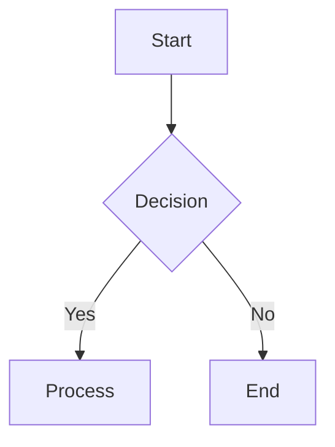

# Markdown Viewer & Diagrams

Create rich diagrams, data visualizations, and architecture views using Markdown with embedded Mermaid, ASCII art, and HTML.

## Diagram Types in Markdown

### Mermaid Diagrams
````markdown

````

Supported diagram types:
- `graph` — Flowcharts (TD, LR, RL)
- `sequenceDiagram` — Sequence/sequence diagrams
- `classDiagram` — Class/object models
- `stateDiagram-v2` — State machines
- `gantt` — Gantt charts
- `pie` — Pie charts
- `flowchart` — Alternative flowchart syntax
- `erDiagram` — Entity-relationship diagrams

### ASCII Tables

```
+----------+---------+----------+
| Service  | Status  | Latency  |
+----------+---------+----------+
| API GW   | 🟢 OK   |  12ms    |
| Auth     | 🟢 OK   |   8ms    |
| Database | 🟡 Slow | 142ms    |
+----------+---------+----------+
```

### Rich HTML Tables
```html
<table>
  <tr><th>Metric</th><th>Value</th><th>Trend</th></tr>
  <tr><td>Uptime</td><td>99.95%</td><td style="color: green">↑</td></tr>
</table>
```

## Data Visualization

### Simple Charts (Unicode/ASCII)
```
Revenue Q1-Q4 2024:
$0         $10k       $20k
█░░░░░░░░░   Q1: $4.2k
███████░░░   Q2: $8.1k
██████████   Q3: $12.5k
██████████   Q4: $14.2k
```

### Sparklines (inline charts)
```
Users: ▁▂▃▄▅▆▇█▇▆▅▄▃▂▁
CPU:   ▄▄▆█▇▆▅▄▃▂▂▃▄▅
```

## Architecture Views

### Layered Architecture
```
┌─────────────────────────────────────────┐
│            🔍 Frontend (React)          │
├─────────────────────────────────────────┤
│         ⚡ API Gateway (Kong)           │
├─────────────────────────────────────────┤
│  🔧 Services        │  📦 Cache (Redis)│
│  ┌──────────┐       │  ┌────────────┐  │
│  │ Auth Svc │       │  │  Redis     │  │
│  │ User Svc │       │  └────────────┘  │
│  │ Order Svc│       │                  │
│  └──────────┘       │                  │
├─────────────────────┴───────────────────┤
│          🗄️ PostgreSQL (Primary)        │
└─────────────────────────────────────────┘
```

## Tips for Effective Markdown Diagrams

1. **Start with Mermaid** for complex diagrams — it's widely supported
2. **Use ASCII fallback** when Mermaid isn't available (README preview, raw markdown)
3. **Color code** ASCII elements with Unicode blocks (█▉▊▋▌▍▎▏)
4. **Include legends** for any non-obvious symbols
5. **Keep diagrams simple** — one concept per diagram, max
6. **Use HTML details/summary** for collapsible sections with large diagrams

## Pitfalls

- Mermaid rendering varies by platform (GitHub vs VS Code vs npm)
- Tab characters in ASCII diagrams break alignment — use spaces
- Unicode box drawing chars may not render in all terminals
- Very wide diagrams overflow on mobile Markdown viewers
- Always include a text description alongside diagrams for accessibility
