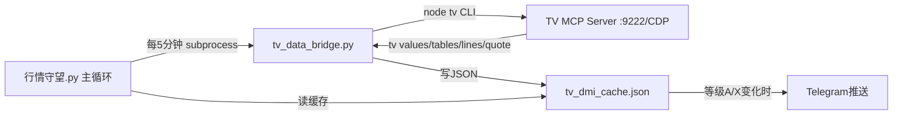

# TV数据桥架构 v1.0

## 问题

TV MCP工具只能在Hermes Agent上下文调用。独立Python脚本（行情守望.py）无法直接调 `mcp_tradingview_data_get_pine_tables()` 等。原本用15分钟cron agent读TV→写缓存→行情守望读，但agent模式在脚本失败时生成详细诊断报告投递TG（噪音）。

## 解决方案



## tv_data_bridge.py 核心

```python
# 用TV自带CLI，不走Hermes agent
_tv("status")       # 检查CDP连接
_tv("values")       # 读指标(VWAP/EMA/CVD/POC/VAH/VAL)
_tv("data", "tables", "--study-filter", "DMI")  # 读DMI决策表
_tv("data", "lines")  # 读Pine线(关键位)
_tv("quote")        # 读实时报价
```

CLI路径: `tools/tradingview-mcp/src/cli/index.js` (npm `tv` 命令)

## 置信度阈值

| 等级 | 推送 | 原因 |
|------|------|------|
| A多/A空 | ✅ | 六指标全共振·最高置信 |
| X | ✅ | 结构冲突·风险预警 |
| B多/B空 | ❌ | 中等偏多/空·不够确定 |
| C等待 | ❌ | 无方向 |

## 刷新频率

5分钟。理由：
- DMI等级15分钟bar收线才变 → 5分钟不会空转
- VWAP/EMA/CVD每tick在动 → 5分钟足够捕获变化
- 关键位突破能在5分钟内检测 → 不等15分钟
- 对齐已有5分钟持仓信号cron

## 集成点

行情守望.py 主循环 (while True):
```python
if now_ts - last_tv_refresh >= 300:
    subprocess.Popen([sys.executable, "scripts/tv_data_bridge.py"],
                     stdout=DEVNULL, stderr=DEVNULL)
    last_tv_refresh = now_ts
```

不阻塞主循环。cache文件由 tv_data_bridge.py 自行写入。行情守望的下一次 `_check_tv_grade_change()` 自动读到新数据。

## 已删除

- cron `TV信号监控·智能推送` (116223704b57) — agent模式·噪音源
- cron `TV信号监控·静默` (9cdf9fa25dcd) — no-agent但无MCP访问能力
