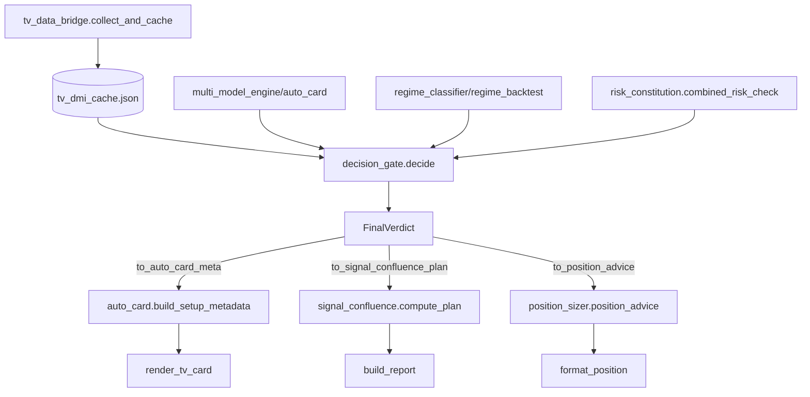

# Python 决策链审计模式 (v1.0 · 2026-07-10)

本次审计发现并修复了棠溪 Python 决策链的六大核心问题，形成可复用的审计/补丁模式。

---

## 审计触发条件
- 用户要求"审计决策链"、"最小兼容补丁"、"统一风险出口"、"实时体制分类"
- 新增/变更 TV 指标字段（如 HALDRO Valid Code、FVG/OB 质量分）
- 发现多处风险计算口径不一、决策分散、门控缺失

---

## 六大核心问题 & 定位模式

| # | 问题域 | 关键定位点（文件:函数/行号） | 审计信号 |
|---|--------|----------------------------|----------|
| 1 | **HALDRO Valid Code 门控缺失** | `tv_data_bridge.py:113-116 read_indicators()`<br>`auto_card.py:489-503 _dual_indicator_verdict()` | 读取了 0/1/2 但未作为硬门拦截下游 |
| 2 | **主副冲突未覆盖最终裁决** | `auto_card.py:529-539 _dual_indicator_verdict()`<br>`auto_card.py:660-672 _apply_tv_dmi_override()` | 冲突只降级文案，未覆盖 `grade/direction/entry` |
| 3 | **FVG/OB 质量分仅透传不消费** | `tv_data_bridge.py:326-328`<br>`auto_card.py:636-637 _build_tv_main_data()` | 存入 cache、映射回 study，无评分加权逻辑 |
| 4 | **统一 FinalVerdict 缺失** | 决策分散在 5 处：`meta`、`dual`、`_dual_indicator_verdict` 返回、`_apply_tv_dmi_override` 返回、`position_advice()` 返回 | 无单一裁决对象，适配器层缺失 |
| 5 | **实时体制分类三套实现不共享** | `regime_classifier.py:51-174`<br>`regime_backtest.py:93-109`<br>`signal_validators.py:90-113` | 宏观/ADX/多周期阈值各自为政，仅用于展示/回测 |
| 6 | **risk_constitution 非唯一出口** | `risk_constitution.py:141-279 check_constitution()`<br>`risk_constitution.py:524-580 adaptive_risk_usd()`<br>`risk_constitution.py:660-702 combined_risk_check()`<br>`auto_card.py:125-162 _adaptive_risk()`<br>`position_sizer.py:52-154 position_size()` | 三处风险口径不一，`combined_risk_check` 无调用方真正用作最终出口 |

---

## 最小兼容补丁设计模式

### 核心原则
1. **零破坏现有产出**：适配器模式，不修改任何现有导出接口
2. **特性开关**：`USE_DECISION_GATE = True/False` 回退旧逻辑
3. **数据契约**：`FinalVerdict` frozen dataclass，仅增字段不减字段
4. **缓存键不变**：`tv_dmi_cache.json` 结构完全不变
5. **渲染层不动**：卡片组装、报文生成零改动

### 新模块架构
```
scripts/
├── decision_gate.py          # 单一决策入口 decide() + 三个 to_*() 适配器
├── regime_thresholds.py      # 共享常量：ADX_TREND=25, EMA_SLOPE_PCT=0.05
└── audit_decision_chain_patch.md  # 本次审计报告
```

### FinalVerdict 统一裁决对象
```python
@dataclass(frozen=True)
class FinalVerdict:
    decision: Literal["GO-A", "GO-B", "WAIT", "NO-GO"]  # 仅四态
    direction: Literal["long", "short", "wait"]
    entry_price: Optional[float]
    stop_price: Optional[float]
    target_price: Optional[float]
    risk_usd: float
    risk_pct: float
    rr_ratio: Optional[float]
    regime: str                    # LOW_VOL_BULL / HIGH_VOL_BEAR / ...
    regime_risk_level: str         # low/medium/high/extreme
    drawdown_tier: str             # full/half/quarter/micro/paused
    volatility_regime: str         # calm/normal/volatile
    haldro_valid_code: int         # 0/1/2
    haldro_risk_code: int
    main_sub_conflict: bool
    fvg_quality: Optional[float]
    ob_quality: Optional[float]
    reasons: list[str]
    violations: list[str]
```

### 三个适配器（兼容层）
| 适配器 | 消费方 | 关键映射 |
|--------|--------|----------|
| `to_auto_card_meta()` | `auto_card.build_setup_metadata()` | `decision→status/priority_plan`，`direction→direction`，`risk_usd→risk_usd` |
| `to_signal_confluence_plan()` | `signal_confluence.compute_plan()` | `entry/stop/targets/risk_pct/r_ratio` 直通 |
| `to_position_advice()` | `position_sizer.position_advice()` | `tier = decision` 映射，`size_pct = risk_pct*100` |

---

## TDD 红灯测试清单（16 项·必须先写）

| # | 测试名 | 场景 | 预期 decision | 关键断言 |
|---|--------|------|---------------|----------|
| 1 | `test_haldro_valid_0_blocks` | `haldro_valid_code=0` | `NO-GO` | `violations` 含 "HALDRO 无效码 0"；`risk_usd=0` |
| 2 | `test_haldro_valid_1_fallback` | `haldro_valid_code=1`，主副冲突 | `WAIT` | `decision != "GO-A"` |
| 3 | `test_haldro_valid_2_aggregated` | `haldro_valid_code=2`，主副同向，RR≥2 | `GO-A` | `decision=="GO-A"` |
| 4 | `test_main_sub_conflict_downgrade` | SVP=偏多、HALDRO=偏空 | `WAIT`/`GO-B` | `main_sub_conflict=True` |
| 5 | `test_fvg_ob_quality_consumption` | FVG质量低、OB质量高 | `GO-B` | `reasons` 含 "FVG质量低"；`risk_usd` 降级 |
| 6 | `test_regime_trend_boost` | ADX≥25+EMA斜率>0.05% | `GO-A` | `regime=="trend"` |
| 7 | `test_regime_range_penalty` | ADX<20 | `WAIT`/`GO-B` | `regime=="range"`；`risk_usd` 较趋势降≥30% |
| 8 | `test_drawdown_tier_half` | 回撤 8% | `GO-B` | `drawdown_tier=="half"`；`risk_pct≤0.5%` |
| 9 | `test_drawdown_tier_paused` | 回撤 22% | `NO-GO` | `drawdown_tier=="paused"`；`risk_usd=0` |
| 10 | `test_volatility_calm_boost` | BB宽度<1% | `GO-A` | `volatility_regime=="calm"` |
| 11 | `test_volatility_volatile_cut` | BB宽度>3% | `GO-B`/`WAIT` | `volatility_regime=="volatile"`；`risk_usd≤基准×0.5` |
| 12 | `test_risk_constitution_single_exit` | 日回撤5%+连亏3+高波 | `NO-GO` | 仅调用一次 `combined_risk_check` |
| 13 | `test_final_verdict_enum_only` | 任意输入 | 四态之一 | 无其他字符串 |
| 14 | `test_adapter_auto_card_meta` | `GO-A, long` | `status=="A做多"` | 键全覆盖旧期望 |
| 15 | `test_adapter_signal_confluence_plan` | `GO-B, short` | `qualified==True` | 含 entry/stop/targets/r_ratio |
| 16 | `test_adapter_position_advice` | `WAIT, wait` | `tier=="等待"` | 结构兼容旧返回 |

---

## 实施顺序（可直接复用）

1. 新建 `scripts/decision_gate.py` + `scripts/regime_thresholds.py`
2. 写入 `tests/test_decision_gate.py` 16 个失败测试
3. 实现 `decide()` 核心流程（按伪代码顺序：TV缓存→体制分类→主副裁决→风控宪法→组装）
4. 实现三个 `to_*()` 适配器（对照旧返回结构逐字段映射）
5. `auto_card.py` 顶部加开关，`build_setup_metadata` 改调适配器
6. `position_sizer.py`、`signal_confluence.py` 同理接入
7. 跑全量现有测试（`test_render_tv_card.py`、`test_card_render_locked.py` 等必须全绿）
8. 删除 `_legacy_*` 兜底代码

---

## 验收标准（Checklist）

- [ ] 16 个测试全部绿灯
- [ ] `auto_card.py BTCUSDT` 终端输出逐行对比**无差异**
- [ ] `signal_confluence.py` 推送报文结构不变
- [ ] `position_sizer.py` CLI demo 输出格式不变
- [ ] `grep -r "adaptive_risk_usd" --include="*.py"` 仅剩 `decision_gate.py` 与 `combined_risk_check` 内部
- [ ] `regime_classifier` 与 `regime_backtest` 共享 `regime_thresholds.ADX_TREND=25`、`EMA_SLOPE_PCT=0.05`

---

## 关键数据流向（Mermaid）



---

## 关联文件
- `scripts/audit_decision_chain_patch.md` — 本次完整审计报告
- `scripts/decision_gate.py` — 新决策入口（实施后生成）
- `scripts/regime_thresholds.py` — 共享阈值常量（实施后生成）
- `tests/test_decision_gate.py` — TDD 测试套件（实施后生成）