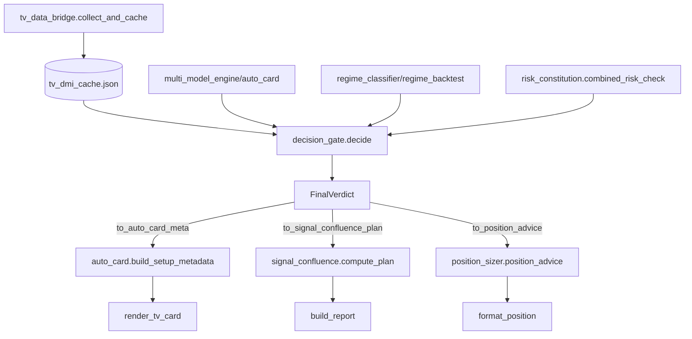

# Python 决策链审计 & 最小兼容补丁设计模式

> 适用场景：对已运行的交易系统 Python 决策链路进行**只读审计**，输出**不修改共享文件**的最小兼容集成补丁设计。

---

## 触发条件
- 用户要求"审计当前 Python 决策链并设计最小兼容集成补丁"
- 关键词：`审计决策链`、`最小补丁`、`不直接修改共享文件`、`兼容策略`、`失败测试清单`

---

## 审计模板（按本次会话实战提炼）

### 1. 现状定位表（关键文件 & 行号 & 现状问题）

| 关键点 | 文件 | 行号/函数 | 现状问题 |
|--------|------|-----------|----------|
| HALDRO Valid Code 门控 | `tv_data_bridge.py` | 113-116 `read_indicators()` | 仅读取存 cache，未作为硬门拦截下游 |
| | `auto_card.py` | 489-503 `_dual_indicator_verdict()` | 仅用于 risk_text 文案，0/1/2 未作硬门 |
| 主副冲突覆盖最终裁决 | `auto_card.py` | 529-539 `_dual_indicator_verdict()` | 冲突只降级 state 文案，未覆盖 grade/direction/entry |
| | `auto_card.py` | 660-672 `_apply_tv_dmi_override()` | TV DMI 直接覆盖 bias/grade/status，与双指标裁决分离 |
| FVG/OB 质量分消费 | `tv_data_bridge.py` | 326-328 `read_indicators()` | 读取透传 render，无评分消费逻辑 |
| | `auto_card.py` | 636-637 `_build_tv_main_data()` | 仅存入 main dict，render 用 |
| 统一 FinalVerdict | — | — | **缺失**：决策分散在 meta/dual/_dual_indicator_verdict/_apply_tv_dmi_override/position_advice 五处 |
| 实时体制分类 | `regime_classifier.py` | 51-174 `classify_regime()` | 宏观多资产分类，仅用于卡片展示 |
| | `regime_backtest.py` | 93-109 `classify_regime()` | ADX/EMA 趋势/震荡判定，仅用于回测分栏 |
| | `signal_validators.py` | 90-113 `tf_alignment()` | 多周期一致性仅作验证闸门 |
| risk_constitution 唯一出口 | `risk_constitution.py` | 141-279 `check_constitution()` | 全维度检查但三处风险口径不一 |
| | `risk_constitution.py` | 524-580 `adaptive_risk_usd()` | 多处调用参数不一 |
| | `risk_constitution.py` | 660-702 `combined_risk_check()` | 组合风险检查无调用方真正用作最终出口 |

---

### 2. 新模块 API 设计模式

**核心原则**：单一入口 `decide()` + 三个适配器 `to_*()`，不修改任何现有导出接口。

```python
# scripts/decision_gate.py
@dataclass(frozen=True)
class FinalVerdict:
    decision: Literal["GO-A", "GO-B", "WAIT", "NO-GO"]  # 仅四态
    direction: Literal["long", "short", "wait"]
    entry_price: Optional[float] = None
    stop_price: Optional[float] = None
    target_price: Optional[float] = None
    risk_usd: float = 0.0
    risk_pct: float = 0.0
    rr_ratio: Optional[float] = None
    regime: str = "UNKNOWN"
    regime_risk_level: str = "medium"
    drawdown_tier: str = "full"
    volatility_regime: str = "normal"
    haldro_valid_code: int = 0      # 0/1/2
    haldro_risk_code: int = 0
    main_sub_conflict: bool = False
    fvg_quality: Optional[float] = None
    ob_quality: Optional[float] = None
    reasons: list[str] = field(default_factory=list)
    violations: list[str] = field(default_factory=list)
    timestamp: str = field(default_factory=...)
    source: str = "decision_gate"

def decide(symbol, engine_data, tv_cache=None, regime_ctx=None) -> FinalVerdict:
    """内部顺序：
      1. 读 TV 缓存 → 提取 HALDRO/FVG-OB
      2. 实时体制分类（复用 regime_classifier + regime_backtest 统一阈值）
      3. 主副冲突裁决 → 产出 direction/entry/stop/target
      4. 风控宪法检查（唯一出口 risk_constitution.combined_risk_check）
      5. 组装 FinalVerdict，决策映射：
           GO-A = 无硬违规、主副同向、RR≥2、risk_usd>0
           GO-B = 有软违规/轻仓但 RR≥1.5、risk_usd>0
           WAIT = 方向不明或 RR<1.5
           NO-GO = 硬违规（熔断/禁做/黑窗/风险=0）
    """

def to_auto_card_meta(verdict: FinalVerdict) -> dict: ...
def to_signal_confluence_plan(verdict: FinalVerdict) -> dict: ...
def to_position_advice(verdict: FinalVerdict) -> dict: ...
```

---

### 3. 需改现有函数/行号（最小侵入）

| 文件 | 函数/行号 | 改动说明 | 兼容策略 |
|------|-----------|----------|----------|
| `auto_card.py` | `build_setup_metadata()` (71-90) | 改调用 `decide()` → `to_auto_card_meta()` | 保留原签名与返回键名，旧逻辑作 `_legacy_` 兜底 |
| `auto_card.py` | `_dual_indicator_verdict()` (425-556) | 提取核心裁决到 `decision_gate._resolve_main_sub()`，本函数作薄包装 | 保留原返回结构 `_dual` 字段，render_tv_card 不变 |
| `auto_card.py` | `_apply_tv_dmi_override()` (660-672) | 合并入 `decision_gate._apply_tv_override()` | 返回格式不变 `{"tv_active": bool}` |
| `auto_card.py` | `_adaptive_risk()` (125-162) | 删本地计算，改调 `combined_risk_check()` | 返回 `risk_usd` 保持 float，reasons 兼容原格式 |
| `position_sizer.py` | `position_size()` (52-154) | 删本地 daily_loss/风险映射，改用 `decide()` 产出的 risk_usd/risk_pct | 保留 `position_advice()` 签名，内部委托新模块 |
| `position_sizer.py` | `_get_max_risk_usd()` (39-49) | 改为直接调 `adaptive_risk_usd()` | 删重复 import 逻辑 |
| `signal_confluence.py` | `compute_plan()` (278-358) | 入口改 `decide()`，仅保留渲染 `build_report()` | `fuse()` 继续产出来源明细供展示 |
| `signal_confluence.py` | `validate_plan()` 调用 (331) | 改用 `decision_gate` 内部已做的验证闸门 | `validate_plan` 保留供外部复用，标记 deprecated |
| `regime_classifier.py` | `classify_regime()` (51-174) | 提取阈值常量到 `decision_gate.regime_thresholds` | 函数保留供宏观卡片用 |
| `regime_backtest.py` | `classify_regime()` (93-109) | 对齐 ADX/EMA 阈值常量到共享模块 | 回测脚本不改，仅 import 共享常量 |
| `signal_validators.py` | `tf_alignment()` (90-113) | 新增返回 `regime_label: "trend"|"range"` | 兼容旧返回字典，新增键不破坏现有调用方 |
| `risk_constitution.py` | `check_constitution()` (141-279) | 标记为内部细节，对外仅暴露 `combined_risk_check()` | 保留函数签名，内部复用 combined_risk_check |
| `risk_constitution.py` | `adaptive_risk_usd()` (524-580) | 参数标准化：统一要求 `atr_pct` 由调用方传入 | atr_pct=0 时回退基准，向后兼容 |

---

### 4. 兼容策略清单（零破坏现有产出）

1. **适配器模式**：新模块只对外暴露 `decide()` + 三个 `to_*()`，**不修改任何现有文件的导出接口**。
2. **特性开关**：`auto_card.py` 顶部 `USE_DECISION_GATE = True`，置 False 回退全旧逻辑（保留 `_legacy_*` 副本）。
3. **数据契约**：`FinalVerdict` 为 frozen dataclass，**仅增字段不减字段**，旧适配器按需取字段。
4. **缓存键不变**：`tv_dmi_cache.json` 结构完全不变，`decision_gate` 只读不写。
5. **渲染层不动**：`render_tv_card.py`、`auto_card.py` 卡片组装、`signal_confluence.py` 报文生成 **零改动**，只消费适配器输出的 dict。

---

### 5. 必须先写的失败测试清单（TDD 红灯优先）

> 在 `tests/test_decision_gate.py` 新建，**先跑红**，再实现 `decision_gate.py` 绿灯。

| # | 测试名 | 场景 | 预期 `decision` | 关键断言 |
|---|--------|------|-----------------|----------|
| 1 | `test_haldro_valid_0_blocks` | TV 缓存 `haldro_valid_code=0` | `NO-GO` | `violations` 含 "HALDRO 无效码 0"；`risk_usd=0` |
| 2 | `test_haldro_valid_1_fallback` | `haldro_valid_code=1`，主副冲突 | `WAIT` | `decision != "GO-A"`；`haldro_valid_code=1` 透传 |
| 3 | `test_haldro_valid_2_aggregated` | `haldro_valid_code=2`，主副同向，RR=2.5，无违规 | `GO-A` | `decision=="GO-A"`；`direction` 与主指标一致 |
| 4 | `test_main_sub_conflict_downgrade` | SVP=偏多、HALDRO=偏空、Composite<0 | `WAIT` 或 `GO-B` | `main_sub_conflict=True`；`direction` 不取冲突方 |
| 5 | `test_fvg_ob_quality_consumption` | `mcp_fvg_quality_score=0.3`（低）、`mcp_ob_quality_score=0.8` | `GO-B` | `reasons` 含 "FVG质量低"；`risk_usd` < 基准 |
| 6 | `test_regime_trend_boost` | ADX≥25+EMA斜率>0.05% → `regime="trend"`，偏多 | `GO-A` | `regime=="trend"`；`regime_risk_level` 非 extreme |
| 7 | `test_regime_range_penalty` | ADX<20 → `regime="range"`，偏多 | `WAIT` 或 `GO-B` | `regime=="range"`；`risk_usd` 较趋势态降 ≥30% |
| 8 | `test_drawdown_tier_half` | `current_drawdown_pct=0.08`（8%） | `GO-B` | `drawdown_tier=="half"`；`risk_pct` ≤ 0.5% |
| 9 | `test_drawdown_tier_paused` | `current_drawdown_pct=0.22`（22%） | `NO-GO` | `drawdown_tier=="paused"`；`risk_usd=0` |
| 10 | `test_volatility_calm_boost` | `atr_pct=0.008`（BB宽度<1%） | `GO-A` | `volatility_regime=="calm"`；`risk_usd` ≥ 基准×1.2 |
| 11 | `test_volatility_volatile_cut` | `atr_pct=0.045`（BB宽度>3%） | `GO-B` 或 `WAIT` | `volatility_regime=="volatile"`；`risk_usd` ≤ 基准×0.5 |
| 12 | `test_risk_constitution_single_exit` | 同时触发：日回撤5%+连亏3+波动率高 | `NO-GO` | `violations` 含全部三项；`risk_usd=0`；**仅调用一次** `combined_risk_check` |
| 13 | `test_final_verdict_enum_only` | 任意输入 | `in {"GO-A","GO-B","WAIT","NO-GO"}` | 无其他字符串出现 |
| 14 | `test_adapter_auto_card_meta` | `FinalVerdict(GO-A, long, ...)` | `meta["status"]=="A做多"` | `to_auto_card_meta()` 输出键全覆盖 `build_setup_metadata` 期望 |
| 15 | `test_adapter_signal_confluence_plan` | `FinalVerdict(GO-B, short, ...)` | `plan["qualified"]==True` | `to_signal_confluence_plan()` 输出含 entry/stop/targets/risk_pct/r_ratio |
| 16 | `test_adapter_position_advice` | `FinalVerdict(WAIT, wait, ...)` | `advice["tier"]=="等待"` | `to_position_advice()` 结构兼容 `position_sizer.position_advice` 返回 |

---

### 6. 实施顺序建议

1. 新建 `scripts/decision_gate.py` + `scripts/regime_thresholds.py`（共享常量）
2. 写上述 16 个失败测试（`tests/test_decision_gate.py`）
3. 实现 `decide()` 核心流程（按第 2 节伪代码顺序）
4. 实现三个 `to_*()` 适配器（对照现有返回结构逐字段映射）
5. `auto_card.py` 顶部加开关，`build_setup_metadata` 改调用适配器
6. `position_sizer.py`、`signal_confluence.py` 同理接入适配器
7. 跑全量测试（现有 `test_render_tv_card.py`、`test_card_render_locked.py` 等必须全绿）
8. 验收通过后删除 `_legacy_*` 兜底代码

---

### 7. 关键数据流向图



---

### 8. 验收标准

- [ ] 16 个测试全部绿灯
- [ ] 现有 `auto_card.py BTCUSDT` 终端输出逐行对比 **无差异**（除决策字段来源变为 `decision_gate`）
- [ ] `signal_confluence.py` 推送报文结构不变
- [ ] `position_sizer.py` CLI demo 输出格式不变
- [ ] `risk_constitution.combined_risk_check` 成为**全代码库唯一**风险金额计算出口（grep `adaptive_risk_usd` 调用处仅剩 `decision_gate` 与 `combined_risk_check` 内部）
- [ ] `regime_classifier` 与 `regime_backtest` 共享 `regime_thresholds.ADX_TREND=25`、`EMA_SLOPE_PCT=0.05` 常量

---

## 相关文件（本次会话产出）

- `scripts/audit_decision_chain_patch.md` — 完整审计报告与补丁设计
- `scripts/decision_gate.py` — 新模块（待实施时创建）
- `scripts/regime_thresholds.py` — 共享阈值常量（待实施时创建）
- `tests/test_decision_gate.py` — 16 个红灯测试（待实施时创建）