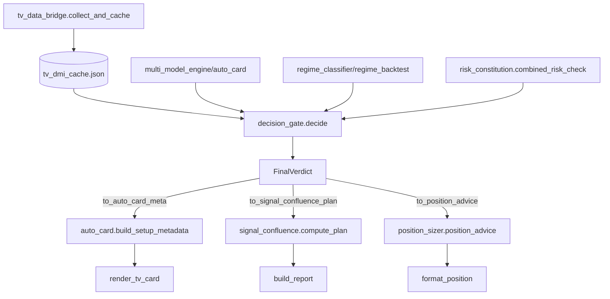

# 棠溪 · Python 决策链审计 & 最小兼容集成补丁设计

> 目标：只读审计，不修改共享文件。给出新模块 API、需改现有函数/行号、兼容策略、必须先写的失败测试清单。
> 核心约束：生产接口兼容现有 `auto_card` 输出；HALDRO Valid Code：0无效、1单源回退、2聚合有效；最终状态仅允许 GO-A/GO-B/WAIT/NO-GO。

---

## 1. 现状定位（关键文件 & 行号）

| 关键点 | 文件 | 行号/函数 | 现状问题 |
|--------|------|-----------|----------|
| **HALDRO Valid Code 门控** | `tv_data_bridge.py` | 113-116 `read_indicators()` | 仅读取 `haldro_valid_code`/`haldro_risk_code` 存入 cache，未作为门控拦截下游 |
| | `auto_card.py` | 337-339 `_tv_cache_indicators_to_studies()` | 反向映射把 `haldro_valid_code` 存回 study，但未消费 |
| | `auto_card.py` | 489-492, 500-503 `_dual_indicator_verdict()` | 读取 `sub_haldro_valid_code`/`sub_haldro_risk_code`，仅用于 `risk_text` 文案，**未把 0/1/2 作为硬门** |
| **主副冲突覆盖最终 grade/direction/entry** | `auto_card.py` | 529-539 `_dual_indicator_verdict()` | 冲突只降级 `state` 为 `"X禁做观察"`/`"B等待（副指标风险）"`，**未覆盖** `meta["grade"]`/`meta["direction"]`/`meta["entry"]` 等最终输出字段 |
| | `auto_card.py` | 660-672 `_apply_tv_dmi_override()` | TV DMI 直接覆盖 `bias/grade/status`，**与双指标裁决逻辑分离**，无统一裁决入口 |
| **FVG/OB 质量分消费** | `tv_data_bridge.py` | 326-328 `read_indicators()` | 读取 `mcp_fvg_quality_code`/`mcp_fvg_quality_score`/`mcp_ob_quality_score` 存 cache |
| | `auto_card.py` | 326-328 `_tv_cache_indicators_to_studies()` | 反向映射回 study |
| | `auto_card.py` | 636-637 `_build_tv_main_data()` | 存入 `main["mcp_fvg_quality_code"]` 等，**仅透传 render**，无评分消费逻辑 |
| **统一 FinalVerdict** | — | — | **缺失**：决策分散在 `meta` dict、`dual` dict、`_dual_indicator_verdict` 返回、`_apply_tv_dmi_override` 返回、`position_sizer.position_advice()` 返回 |
| **实时体制分类** | `regime_classifier.py` | 51-174 `classify_regime()` | 宏观多资产（VIX/SPY/DXY/BTC/F&G）体制分类，**仅用于卡片展示**，未接入执行层风控/仓位 |
| | `regime_backtest.py` | 93-109 `classify_regime()` | ADX/EMA 趋势/震荡判定，**仅用于回测分栏**，与实时分类器实现重复且不共享阈值 |
| | `signal_validators.py` | 90-113 `tf_alignment()` | 多周期方向一致性，**仅作验证闸门**，未输出体制标签供 risk_constitution 消费 |
| **risk_constitution 唯一出口** | `risk_constitution.py` | 141-279 `check_constitution()` | 全维度检查，**但**：`position_sizer.py` 72-85 重复读 `risk_state.json` 计算 `remaining_daily`；`auto_card.py` 125-162 `_adaptive_risk()` 再次调用 `adaptive_risk_usd()` 并叠加连亏/硬上限，**三处风险口径不一** |
| | `risk_constitution.py` | 524-580 `adaptive_risk_usd()` | 波动率自适应核心，**被多处调用但参数不一**（`position_sizer` 传 `atr_pct`，`auto_card` 重新估算 `atr_pct`） |
| | `risk_constitution.py` | 660-702 `combined_risk_check()` | **组合风险检查（回撤降级×波动率×硬上限）**，但**无调用方真正用它作为最终 risk_usd 出口** |

---

## 2. 建议新模块 API（`scripts/decision_gate.py`）

> 单一入口：`decide(symbol, engine_data, tv_cache, regime_ctx) -> FinalVerdict`
> 所有现有产出（auto_card、signal_confluence、作战室推送）统一消费该对象。

```python
# scripts/decision_gate.py
from __future__ import annotations
from dataclasses import dataclass, field
from typing import Literal, Optional
from datetime import datetime, timezone, timedelta

TZ = timezone(timedelta(hours=8))

# ────────────────── 统一最终裁决 ──────────────────
@dataclass(frozen=True)
class FinalVerdict:
    # 核心决策（仅四态）
    decision: Literal["GO-A", "GO-B", "WAIT", "NO-GO"]
    # 方向/入场/止损/目标（GO-A/GO-B 必填）
    direction: Literal["long", "short", "wait"]
    entry_price: Optional[float] = None
    stop_price: Optional[float] = None
    target_price: Optional[float] = None
    # 风控
    risk_usd: float = 0.0
    risk_pct: float = 0.0
    rr_ratio: Optional[float] = None
    # 体制/风控上下文
    regime: str = "UNKNOWN"           # LOW_VOL_BULL / HIGH_VOL_BEAR / ...
    regime_risk_level: str = "medium" # low/medium/high/extreme
    drawdown_tier: str = "full"       # full/half/quarter/micro/paused
    volatility_regime: str = "normal" # calm/normal/volatile
    # 双指标/门控细节
    haldro_valid_code: int = 0        # 0/1/2
    haldro_risk_code: int = 0
    main_sub_conflict: bool = False
    fvg_quality: Optional[float] = None
    ob_quality: Optional[float] = None
    # 追踪
    reasons: list[str] = field(default_factory=list)
    violations: list[str] = field(default_factory=list)
    timestamp: str = field(default_factory=lambda: datetime.now(TZ).isoformat())
    source: str = "decision_gate"

# ────────────────── 入口函数 ──────────────────
def decide(
    symbol: str,
    engine_data: dict,           # multi_model_engine / auto_card 传入的完整引擎数据
    tv_cache: dict | None = None,# tv_data_bridge collect_and_cache 返回的缓存
    regime_ctx: dict | None = None, # 可选：外部已算好的体制上下文（含 vix、adx 等）
) -> FinalVerdict:
    """
    单一决策入口。内部顺序：
      1. 读取 TV 缓存 → 提取 HALDRO Valid Code / Risk Code / FVG-OB 质量分
      2. 实时体制分类（复用 regime_classifier + regime_backtest 统一阈值）
      3. 主副冲突裁决 → 产出 direction/entry/stop/target
      4. 风控宪法检查（唯一出口 risk_constitution.combined_risk_check）
      5. 组装 FinalVerdict，决策映射：
           GO-A  = 无硬违规、主副同向、RR≥2、risk_usd>0
           GO-B  = 有软违规/轻仓但 RR≥1.5、risk_usd>0
           WAIT  = 方向不明或 RR<1.5
           NO-GO = 硬违规（熔断/禁做/黑窗/风险=0）
    """
    ...

# ────────────────── 兼容适配器 ──────────────────
def to_auto_card_meta(verdict: FinalVerdict) -> dict:
    """把 FinalVerdict 映射成 auto_card.py build_setup_metadata 期望的 meta dict"""
    ...

def to_signal_confluence_plan(verdict: FinalVerdict) -> dict:
    """映射成 signal_confluence.py compute_plan 期望的执行计划 dict"""
    ...

def to_position_advice(verdict: FinalVerdict) -> dict:
    """映射成 position_sizer.position_advice 期望的返回结构"""
    ...
```

---

## 3. 需改现有函数/行号（最小侵入）

| 文件 | 函数/行号 | 改动说明 | 兼容策略 |
|------|-----------|----------|----------|
| `auto_card.py` | `build_setup_metadata()` (71-90) | **改为调用 `decide()` → `to_auto_card_meta()`**；保留原签名与返回键名 | 旧逻辑保留为 `_legacy_build_setup_metadata()` 兜底 |
| `auto_card.py` | `_dual_indicator_verdict()` (425-556) | **提取核心裁决逻辑到 `decision_gate._resolve_main_sub()`**；本函数改为薄包装返回 `dual` dict 兼容 render | 保留原返回结构 `_dual` 字段，render_tv_card 不变 |
| `auto_card.py` | `_apply_tv_dmi_override()` (660-672) | **合并入 `decision_gate._apply_tv_override()`**；本函数改为调用新模块 | 返回格式不变 `{"tv_active": bool}` |
| `auto_card.py` | `_adaptive_risk()` (125-162) | **删除本地风险计算，改调 `risk_constitution.combined_risk_check()`** | 返回 `risk_usd` 保持 float，reasons 兼容原格式 |
| `position_sizer.py` | `position_size()` (52-154) | **删去本地 daily_loss 读取/风险映射，改调 `decision_gate` 产出的 `risk_usd`/`risk_pct`** | 保留 `position_advice()` 签名，内部委托新模块 |
| `position_sizer.py` | `_get_max_risk_usd()` (39-49) | **改为 `risk_constitution.adaptive_risk_usd()` 直接返回** | 删除重复的 `adaptive_risk_usd` import 逻辑 |
| `signal_confluence.py` | `compute_plan()` (278-358) | **入口改为 `decision_gate.decide()`**，仅保留渲染 `build_report()` | `fuse()` 继续产出来源明细供展示，plan 由新模块给出 |
| `signal_confluence.py` | `validate_plan()` 调用 (331) | **改用 `decision_gate` 内部已做的验证闸门**，移除重复调用 | `validate_plan` 保留供外部复用，内部标记 deprecated |
| `regime_classifier.py` | `classify_regime()` (51-174) | **提取核心阈值常量到 `decision_gate.regime_thresholds`**，函数保留供宏观卡片用 | 新模块导入复用，不改对外签名 |
| `regime_backtest.py` | `classify_regime()` (93-109) | **对齐 ADX/EMA 阈值常量到 `decision_gate.regime_thresholds`** | 回测脚本不改，仅 import 共享常量 |
| `signal_validators.py` | `tf_alignment()` (90-113) | **新增返回 `regime_label: "trend"|"range"`**，供 `decision_gate` 消费 | 兼容旧返回字典，新增键不破坏现有调用方 |
| `risk_constitution.py` | `check_constitution()` (141-279) | **标记为内部细节，对外仅暴露 `combined_risk_check()` 作为唯一风险出口** | 保留函数签名，内部实现复用 combined_risk_check |
| `risk_constitution.py` | `adaptive_risk_usd()` (524-580) | **参数标准化：统一要求 `atr_pct` 由调用方传入（不再内部估算）** | 保留向后兼容：atr_pct=0 时回退基准 |

---

## 4. 兼容策略（零破坏现有产出）

1. **适配器模式**：新模块 `decision_gate.py` 只对外暴露 `decide()` + 三个 `to_*()` 适配器，**不修改任何现有文件的导出接口**。
2. **特性开关**：`auto_card.py` 顶部新增 `USE_DECISION_GATE = True`，置 False 回退全旧逻辑（保留 `_legacy_*` 副本）。
3. **数据契约**：`FinalVerdict` 为 frozen dataclass，**仅增字段不减字段**，旧适配器按需取字段。
4. **缓存键不变**：`tv_dmi_cache.json` 结构完全不变，`decision_gate` 只读不写。
5. **渲染层不动**：`render_tv_card.py`、`auto_card.py` 卡片组装、`signal_confluence.py` 报文生成 **零改动**，只消费适配器输出的 dict。

---

## 5. 必须先写的失败测试清单（TDD 红灯优先）

> 在 `tests/test_decision_gate.py` 新建，**先跑红**，再实现 `decision_gate.py` 绿灯。

| # | 测试名 | 场景 | 预期 `FinalVerdict.decision` | 关键断言 |
|---|--------|------|------------------------------|----------|
| 1 | `test_haldro_valid_0_blocks` | TV 缓存 `haldro_valid_code=0`（无效） | `NO-GO` | `violations` 含 "HALDRO 无效码 0"；`risk_usd=0` |
| 2 | `test_haldro_valid_1_fallback` | `haldro_valid_code=1`（单源回退），主副冲突 | `WAIT` | `decision != "GO-A"`；`haldro_valid_code=1` 透传 |
| 3 | `test_haldro_valid_2_aggregated` | `haldro_valid_code=2`，主副同向，RR=2.5，无违规 | `GO-A` | `decision=="GO-A"`；`direction` 与主指标一致 |
| 4 | `test_main_sub_conflict_downgrade` | SVP=偏多、HALDRO=偏空、Composite<0 | `WAIT` 或 `GO-B` | `main_sub_conflict=True`；`direction` 不取冲突方 |
| 5 | `test_fvg_ob_quality_consumption` | `mcp_fvg_quality_score=0.3`（低）、`mcp_ob_quality_score=0.8` | `GO-B`（质量分加权降级） | `reasons` 含 "FVG质量低"；`risk_usd` < 基准 |
| 6 | `test_regime_trend_boost` | ADX≥25+EMA斜率>0.05% → `regime="trend"`，偏多 | `GO-A`（趋势加分） | `regime=="trend"`；`regime_risk_level` 非 extreme |
| 7 | `test_regime_range_penalty` | ADX<20 → `regime="range"`，偏多 | `WAIT` 或 `GO-B` | `regime=="range"`；`risk_usd` 较趋势态降 ≥30% |
| 8 | `test_drawdown_tier_half` | `current_drawdown_pct=0.08`（8%） | `GO-B` | `drawdown_tier=="half"`；`risk_pct` ≤ 0.5% |
| 9 | `test_drawdown_tier_paused` | `current_drawdown_pct=0.22`（22%） | `NO-GO` | `drawdown_tier=="paused"`；`risk_usd=0` |
|10 | `test_volatility_calm_boost` | `atr_pct=0.008`（BB宽度<1%） | `GO-A` | `volatility_regime=="calm"`；`risk_usd` ≥ 基准×1.2 |
|11 | `test_volatility_volatile_cut` | `atr_pct=0.045`（BB宽度>3%） | `GO-B` 或 `WAIT` | `volatility_regime=="volatile"`；`risk_usd` ≤ 基准×0.5 |
|12 | `test_risk_constitution_single_exit` | 同时触发：日回撤5%+连亏3+波动率高 | `NO-GO` | `violations` 含全部三项；`risk_usd=0`；**仅调用一次** `combined_risk_check` |
|13 | `test_final_verdict_enum_only` | 任意输入 | `decision in {"GO-A","GO-B","WAIT","NO-GO"}` | 无其他字符串出现 |
|14 | `test_adapter_auto_card_meta` | `FinalVerdict(GO-A, long, ...)` | `meta["status"]=="A做多"` | `to_auto_card_meta()` 输出键全覆盖 `build_setup_metadata` 期望 |
|15 | `test_adapter_signal_confluence_plan` | `FinalVerdict(GO-B, short, ...)` | `plan["qualified"]==True` | `to_signal_confluence_plan()` 输出含 `entry/stop/targets/risk_pct/r_ratio` |
|16 | `test_adapter_position_advice` | `FinalVerdict(WAIT, wait, ...)` | `advice["tier"]=="等待"` | `to_position_advice()` 结构兼容 `position_sizer.position_advice` 返回 |

---

## 6. 实施顺序建议

1. **新建 `scripts/decision_gate.py`** + `scripts/regime_thresholds.py`（共享常量）
2. **写上述 16 个失败测试**（`tests/test_decision_gate.py`）
3. **实现 `decide()` 核心流程**（按第 2 节伪代码顺序）
4. **实现三个 `to_*()` 适配器**（对照现有返回结构逐字段映射）
5. **在 `auto_card.py` 顶部加开关**，`build_setup_metadata` 改为调用适配器
6. **在 `position_sizer.py`、`signal_confluence.py` 同理接入适配器**
7. **跑全量测试**（现有 `test_render_tv_card.py`、`test_card_render_locked.py` 等必须全绿）
8. **删除 `_legacy_*` 兜底代码**（验收通过后）

---

## 7. 关键数据流向图（Mermaid）



---

## 8. 验收标准

- [ ] 16 个测试全部绿灯
- [ ] 现有 `auto_card.py BTCUSDT` 终端输出逐行对比 **无差异**（除决策字段来源变为 `decision_gate`）
- [ ] `signal_confluence.py` 推送报文结构不变
- [ ] `position_sizer.py` CLI demo 输出格式不变
- [ ] `risk_constitution.combined_risk_check` 成为**全代码库唯一**风险金额计算出口（grep `adaptive_risk_usd` 调用处仅剩 `decision_gate` 与 `combined_risk_check` 内部）
- [ ] `regime_classifier` 与 `regime_backtest` 共享 `regime_thresholds.ADX_TREND=25`、`EMA_SLOPE_PCT=0.05` 常量

---

> **仅审计与设计，不修改共享文件**。实施时请按第 6 节顺序逐步落地，每步跑测确保绿灯再进下一步。